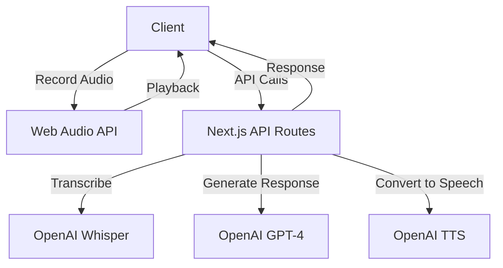

# Voice Agent POC - System Patterns

## Architecture Overview

The application follows a client-server architecture with the following components:

1. **Frontend (Next.js)**

   - React components for UI
   - Web Audio API for recording and playback
   - State management using React hooks
   - API client for backend communication

2. **Backend (Next.js API Routes)**

   - API routes for handling different services
   - Integration with OpenAI APIs
   - Error handling and response formatting

3. **External Services**
   - OpenAI Whisper API for speech-to-text
   - OpenAI GPT-4 for conversation
   - OpenAI TTS API for text-to-speech

## Component Relationships



## Key Technical Decisions

### 1. Next.js App Router

- Uses the new App Router for better performance and features
- API routes for backend functionality
- Server-side components where possible

### 2. State Management

- React hooks for local state
- No global state management needed for POC
- Message history maintained in component state

### 3. Audio Processing

- Web Audio API for recording
- MediaRecorder for audio capture
- HTML5 Audio for playback
- Blob storage for audio data

### 4. API Integration

- OpenAI API integration through Next.js API routes
- FormData for file uploads
- JSON for structured data
- Error handling at each layer

### 5. UI Components

- Custom components built with Radix UI primitives
- Tailwind CSS for styling
- Responsive design patterns
- Accessibility considerations

## Design Patterns

### 1. API Route Pattern

```typescript
export async function POST(request: NextRequest) {
  try {
    // Process request
    // Call external API
    // Format response
    return NextResponse.json(result);
  } catch (error) {
    // Handle errors
    return NextResponse.json({ error }, { status: 500 });
  }
}
```

### 2. Audio Processing Pattern

```typescript
const startRecording = async () => {
  const stream = await navigator.mediaDevices.getUserMedia({ audio: true });
  mediaRecorderRef.current = new MediaRecorder(stream);
  // Setup event handlers
  mediaRecorderRef.current.start();
};
```

### 3. Message Handling Pattern

```typescript
const handleMessage = async (text: string) => {
  const updatedMessages = [...messages, { role: "user", content: text }];
  setMessages(updatedMessages);
  // Process response
  setMessages([...updatedMessages, { role: "assistant", content: response }]);
};
```

## Error Handling Strategy

1. Client-side validation
2. API route error handling
3. External API error handling
4. User-friendly error messages
5. Graceful fallbacks

## Performance Considerations

1. Audio chunking for large recordings
2. Efficient state updates
3. Minimal re-renders
4. Optimized API calls
5. Caching where appropriate
